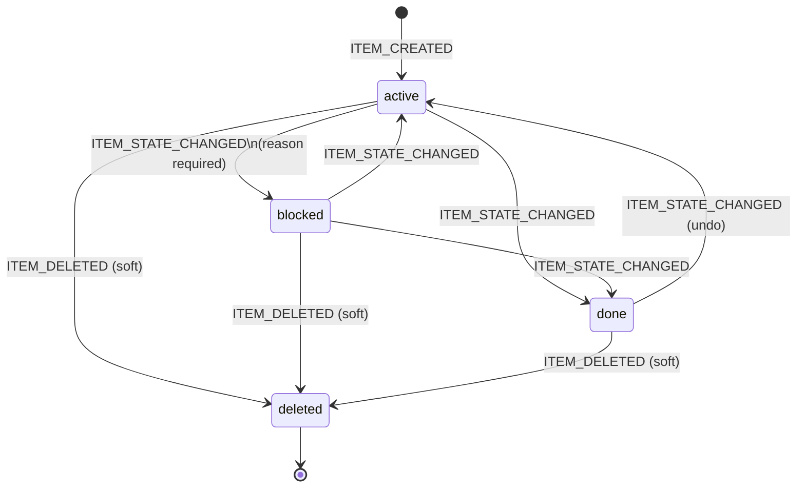
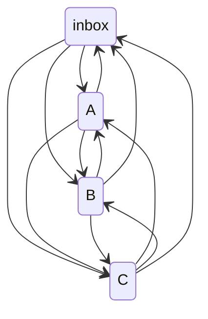
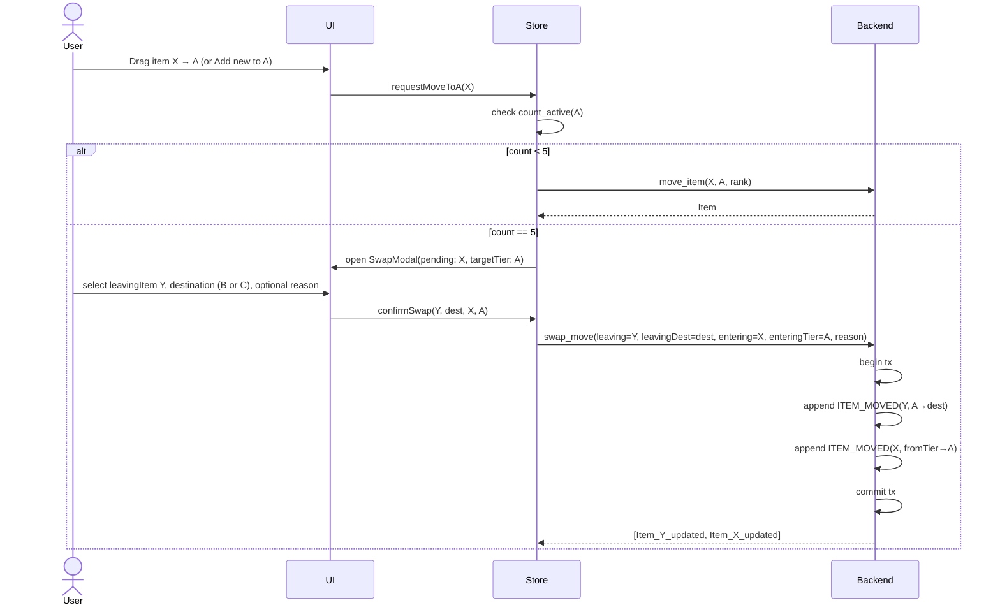

# SPEC.md — Bay

> v1.7 — 2026-06-17. v0.2.0 revamp in progress. Reconciles the spec
> with Phase 4 (I-15..I-19), the P2e cold-context fixes, and Phase 5
> I-20 (LLM re-org proposals). All committed and green (cargo 152/152,
> vitest 93/93). Changes:
>   - §3 gains a batch-operations note (I-19: multi-select → atomic
>     batch state-change/delete; command-layer, no new event types; one
>     tx = one undoable action).
>   - §4.3 `LLM_SUGGESTION_ACCEPTED.resulting_event_ids` is no longer
>     "always empty" — populated by a human-accepted re-org via
>     `accept_suggestion(ops)` since I-20; empty for an observations-only
>     acknowledgement.
>   - §4.3 `ITEM_STATE_CHANGED.blocked_reason` is carried whenever
>     `blocked` is on EITHER side of the transition (P2e fix (a)); apply
>     only consumes it when `state_after == blocked`.
>   - §8 LLM scope: "observe only" → the LLM may now OPTIONALLY propose a
>     re-org (move/done/active) presented as a human-accepted/rejected
>     diff. Firewall unchanged: LLM never writes; deterministic tier
>     applies on accept.
>   - §9 gains "Post-v0.2.0-correctness delivered (Phase 4 + Phase 5
>     I-20)" — I-15..I-20 + the two P2e fixes (restore cap gate;
>     unblock-reason preservation).
> No payload schema changes that break existing event logs (new fields
> are populated, not renamed/removed). Co-pass with CLAUDE.md v1.7 →
> v1.8 and PROMPTS.md v1.4 → v1.5. Prior versions through
> archive/SPEC_v1.6.md.

> Implementation specification. Scope-locked by `CLAUDE.md`. All design decisions in `CLAUDE.md` are authoritative; this document translates them into buildable detail without introducing new scope.

## 0. Reading order

1. `CLAUDE.md` — doctrine. Read first, every session.
2. This document — implementation detail.
3. `PROMPTS.md` (to be written) — per-increment Claude Code prompts.

Sections in this document are independent but cross-reference by number. Section 9 (build plan) is the execution order.

---

## 1. Component tree

### 1.1 State management — choice and rationale

**Zustand.** Single store, TypeScript-native, minimal boilerplate, no providers required, works cleanly with Tauri `invoke` (no middleware needed for async). Rejected alternatives:

- **Redux/RTK**: excessive ceremony for single-user local state; action/reducer pattern duplicates the event-sourcing the Rust backend already owns.
- **Jotai**: atom granularity is valuable for complex reactive graphs; this app has a flat state tree and doesn't benefit.
- **React Context**: re-render fanout on any state change is a drag-and-drop killer; this app will have 50+ items rendered simultaneously.
- **TanStack Query**: optimistic updates for CRUD over Tauri commands is overkill; the command round-trip is <5ms locally and events-out from backend give us real-time invalidation for free.

Store shape:

```ts
interface BayStore {
  // Data (server state)
  items: Record<string, Item>;                        // id → Item
  itemsByTier: Record<Tier, string[]>;                // pre-sorted ids per tier (derived, cached)
  settings: Settings;

  // UI state
  activeView: 'board' | 'calendar' | 'timetravel' | 'archive' | 'settings';
  timeTravelTs: number | null;                        // unix ms when in timetravel mode
  selectedItemId: string | null;                      // for inspector
  modals: {
    quickCapture: boolean;
    swap: { open: boolean; tier: 'A' | 'B'; pendingContent?: string; pendingDropId?: string } | null;
    block: { open: boolean; itemId: string } | null;
    moveReason: { open: boolean; itemId: string; fromTier: Tier; toTier: Tier } | null;
    analyze: boolean;
    settings: boolean;
  };
  analyzeState: {
    running: boolean;
    suggestionId: string | null;
    observations: Observation[];
    error: string | null;
  };

  // Actions (all thin wrappers over invoke)
  loadInitial: () => Promise<void>;
  createItem: (tier: Tier, content: string) => Promise<void>;
  moveItem: (id: string, toTier: Tier, toRank: string, reason?: string) => Promise<void>;
  swapAndCreate: (leavingId: string, leavingDest: 'B' | 'C', newContent: string, newTier: 'A' | 'B') => Promise<void>;
  setState: (id: string, state: ItemState, blockedReason?: string) => Promise<void>;
  editItem: (id: string, content: string) => Promise<void>;
  setDate: (id: string, field: 'start' | 'due', value: number | null) => Promise<void>;
  deleteItem: (id: string) => Promise<void>;

  enterTimeTravel: (ts: number) => Promise<void>;
  exitTimeTravel: () => void;

  analyze: () => Promise<void>;
  acceptAnalyze: () => Promise<void>;
  rejectAnalyze: (reason?: string) => Promise<void>;

  // Internal — called by Tauri event listeners
  _onItemCreated: (item: Item) => void;
  _onItemUpdated: (item: Item) => void;
  _onItemDeleted: (id: string) => void;
  _onLanCapture: (item: Item) => void;
}
```

`itemsByTier` is recomputed on any mutation affecting rank or tier. Rank sorting uses lexicographic string comparison (see §4.2).

### 1.2 Component tree

```
<App>
 ├─ <TauriEventBridge/>                    // no render; subscribes to backend events
 ├─ <TopBar>
 │    ├─ <ViewSwitcher/>                   // Board | Calendar | Time-travel
 │    ├─ <TimeTravelIndicator/>            // only when in timetravel
 │    ├─ <AnalyzeButton/>                  // opens AnalyzePanel
 │    └─ <SettingsButton/>                 // opens Settings
 │
 ├─ <MainContent>
 │    ├─ <BoardView> (default)
 │    │    ├─ <Bay tier="inbox">
 │    │    │    ├─ <BayHeader/>            // title, counter, +Add button
 │    │    │    ├─ <DndContext>
 │    │    │    │    └─ <Strip/>*
 │    │    │    └─ <BayEmptyState/>        // shown when bay empty
 │    │    ├─ <Bay tier="A" cap={5}/>
 │    │    ├─ <Bay tier="B" cap={12}/>
 │    │    └─ <Bay tier="C"/>
 │    │
 │    ├─ <CalendarView>
 │    │    ├─ <MonthNavigator/>
 │    │    ├─ <MonthGrid>
 │    │    │    └─ <DayCell>
 │    │    │         └─ <CalendarItemPill/>*
 │    │    └─ <CalendarLegend/>            // start-date vs due-date color key
 │    │
 │    ├─ <TimeTravelView>
 │    │    ├─ <TimestampPicker/>
 │    │    ├─ <BoardView readOnly/>        // reuses BoardView
 │    │    └─ <ExitTimeTravelButton/>
 │    │
 │    └─ <ArchiveView>                     // v0.1.1 — soft-delete recovery
 │         ├─ <ArchiveRow/>*               // tier badge + content + delete-date + Restore
 │         └─ <ArchiveEmptyState/>
 │
 ├─ <InspectorPanel/>                      // side drawer; opens when selectedItemId
 │
 ├─ <Modals>
 │    ├─ <QuickCaptureModal/>              // global hotkey trigger
 │    ├─ <SwapModal/>                      // A/B cap overflow
 │    ├─ <BlockModal/>                     // require reason
 │    ├─ <MoveReasonModal/>                // optional reason on cross-tier drag
 │    ├─ <AnalyzePanel/>                   // LLM observations + accept/reject
 │    └─ <SettingsModal/>                  // or <SettingsView/> inline
 │
 └─ <ToastHost/>                           // transient notifications
      ├─ <UndoToast/>                      // post-delete restore window (10s)
      └─ <LanCaptureToast/>                // v0.1.1 — fires on lan_capture_received
```

### 1.3 Component ownership rules

- **Data ownership**: all item mutations flow through Zustand store actions, which call Tauri commands. Never mutate store directly from a component; components dispatch actions only.
- **Drag state**: `@dnd-kit` owns transient drag state in its own context; store receives the committed result via `onDragEnd`.
- **Modals**: open/close state lives in store under `modals.*`. Rendering root is `<Modals>`. Components open modals by dispatching store actions (`openSwap(...)`), not by passing props.
- **Derived data**: `itemsByTier` is computed via Zustand selector with referential equality via `shallow`. Strip components subscribe to their own item by id — a move of item X does not re-render item Y.

---

## 2. Wireframes

ASCII wireframes for layout intent. Final styling per system-theme neutrality (CLAUDE.md cut list).

### 2.1 Board view

```
┌──────────────────────────────────────────────────────────────────────────────┐
│ Bay                                                                           │
│ [Board] [Calendar] [Time-travel]                     [Analyze] [⚙ Settings] │
├──────────────────────────────────────────────────────────────────────────────┤
│                                                                               │
│ ▼ INBOX                                                      2 items   [ + ] │
│ ┌─────────────────────────────────────────────────────────────────────────┐ │
│ │ ≡  Idea from phone capture 2h ago                                  · · · │ │
│ │ ≡  Note from hotkey last night                                     · · · │ │
│ └─────────────────────────────────────────────────────────────────────────┘ │
│                                                                               │
│ ▼ A                                                           3 / 5    [ + ] │
│ ┌─────────────────────────────────────────────────────────────────────────┐ │
│ │ ≡  Q3 bond covenant review                              [block] [done]   │ │
│ │ ≡  Prep for Friday 1-on-1 with Marcolin                 [block] [done]   │ │
│ │ ⏸  Waiting on vendor quote — SAN expansion           (blocked: 4 days)   │ │
│ └─────────────────────────────────────────────────────────────────────────┘ │
│                                                                               │
│ ▼ B                                                           9 / 12   [ + ] │
│ ┌─────────────────────────────────────────────────────────────────────────┐ │
│ │ ≡  Draft new backup runbook                             [block] [done]   │ │
│ │ ≡  Review AORTA confidence calibration notes            [block] [done]   │ │
│ │ ⚠  14 days stale — Update network diagram               [block] [done]   │ │
│ │ ... (6 more)                                                              │ │
│ └─────────────────────────────────────────────────────────────────────────┘ │
│                                                                               │
│ ▼ C                                                         21 items   [ + ] │
│ ┌─────────────────────────────────────────────────────────────────────────┐ │
│ │ ≡  Learn Rust async internals properly                                   │ │
│ │ ... (virtualized; showing 20 of 21)                                      │ │
│ └─────────────────────────────────────────────────────────────────────────┘ │
│                                                                               │
└──────────────────────────────────────────────────────────────────────────────┘
```

Strip annotations:
- `≡` drag handle
- `●` active (default, no badge shown in final design — just absence of other badges)
- `⏸` blocked, with reason preview and age
- `⚠` stale (exceeds staleness threshold)
- `· · ·` overflow menu (edit, set dates, delete, inspect)
- Done items: strikethrough, reduced opacity, collapsed to single line, remain in place until archive or session end.

### 2.2 Swap modal

```
┌──────────────────────────────────────────────────────────────────┐
│ A is full (5 / 5)                                             ✕  │
├──────────────────────────────────────────────────────────────────┤
│ To add "Review bond payment schedule" to A, one A item must      │
│ leave A. Pick one to move.                                       │
│                                                                   │
│ ○ Q3 bond covenant review        → ● B    ○ C                    │
│ ○ Prep 1-on-1 with Marcolin      → ● B    ○ C                    │
│ ○ Vendor quote (blocked)         → ● B    ○ C                    │
│                                                                   │
│ Reason (optional): [________________________________________]    │
│                                                                   │
│                              [ Cancel ]   [ Swap ]               │
└──────────────────────────────────────────────────────────────────┘
```

### 2.3 Quick capture modal (global hotkey)

```
┌──────────────────────────────────────────────────────┐
│ Quick capture → Inbox                                │
├──────────────────────────────────────────────────────┤
│ ┌──────────────────────────────────────────────────┐ │
│ │                                                  │ │
│ │                                                  │ │
│ └──────────────────────────────────────────────────┘ │
│                                                       │
│ Esc cancel · Enter commit · Ctrl+Enter commit & open │
└──────────────────────────────────────────────────────┘
```

### 2.4 Block modal

```
┌──────────────────────────────────────────────────┐
│ Mark blocked                                  ✕  │
├──────────────────────────────────────────────────┤
│ What's blocking this item?                        │
│ ┌──────────────────────────────────────────────┐ │
│ │                                              │ │
│ └──────────────────────────────────────────────┘ │
│                                                   │
│                         [ Cancel ]   [ Block ]   │
└──────────────────────────────────────────────────┘
```

### 2.5 Move reason modal (cross-tier drag)

```
┌──────────────────────────────────────────────────┐
│ Moving A → C                                  ✕  │
├──────────────────────────────────────────────────┤
│ Item: "Q3 bond covenant review"                   │
│                                                   │
│ Reason (optional): [_______________________]      │
│                                                   │
│                     [ Cancel ]   [ Confirm ]     │
└──────────────────────────────────────────────────┘
```

### 2.6 Inspector panel (side drawer)

```
┌─────────────────────────────────────────────────────┐
│ Item history                                    ✕  │
├─────────────────────────────────────────────────────┤
│ "Q3 bond covenant review"                           │
│                                                      │
│ Tier: A · Rank: m3k · State: active                 │
│ Created: 2026-04-18 14:22                           │
│ Start: 2026-04-20 · Due: 2026-04-30                 │
│                                                      │
│ ── EVENTS ──                                        │
│                                                      │
│ 2026-04-18 14:22  CREATED in inbox                  │
│ 2026-04-18 14:25  MOVED inbox → A                   │
│                   reason: "blocking monthly close"  │
│ 2026-04-19 09:10  DATE_SET due=2026-04-30           │
│ 2026-04-21 11:04  STATE blocked                     │
│                   reason: "waiting on trustee reply"│
│ 2026-04-22 15:30  STATE active                      │
│                                                      │
└─────────────────────────────────────────────────────┘
```

### 2.7 Calendar view

```
┌──────────────────────────────────────────────────────────────────┐
│ [Board] [Calendar] [Time-travel]                                  │
│                                                                   │
│                  ◂  April 2026  ▸                                 │
│ ┌──────┬──────┬──────┬──────┬──────┬──────┬──────┐              │
│ │ Mon  │ Tue  │ Wed  │ Thu  │ Fri  │ Sat  │ Sun  │              │
│ ├──────┼──────┼──────┼──────┼──────┼──────┼──────┤              │
│ │      │      │  1   │  2   │  3   │  4   │  5   │              │
│ │      │      │ ▸ Q3 │      │      │      │      │              │
│ ├──────┼──────┼──────┼──────┼──────┼──────┼──────┤              │
│ │  6   │  7   │  8   │  9   │ 10   │ 11   │ 12   │              │
│ ...                                                               │
│ Legend:  ▸ start-date    ● due-date                              │
└──────────────────────────────────────────────────────────────────┘
```

Day-cell click opens a day sheet listing all items with that start or due date. Only items with explicit `start_at` or `due_at` render.

### 2.8 Time-travel view

```
┌──────────────────────────────────────────────────────────────────┐
│ Time-travel   ⟵ 2026-04-22 09:00  [________|___]  now ⟶   [Exit]│
│ READ ONLY                                                         │
├──────────────────────────────────────────────────────────────────┤
│ ... (BoardView reused, disabled interactions)                    │
└──────────────────────────────────────────────────────────────────┘
```

Scrubber covers the earliest-event-timestamp → now range. Discrete snap points at every event boundary optional (v2).

### 2.9 LAN capture page (served from Rust backend)

Single HTML page. Mobile-optimized. Rendered at `GET /`.

```
┌──────────────────────────────┐
│ Bay — Capture to Inbox        │
├──────────────────────────────┤
│ ┌──────────────────────────┐ │
│ │                          │ │
│ │                          │ │
│ │                          │ │
│ └──────────────────────────┘ │
│                              │
│        [ Capture ]           │
│                              │
│ Recent (this device):        │
│ 14:22  Idea from walk        │
│ 12:05  Reminder for dentist  │
└──────────────────────────────┘
```

`Recent` list is session-local (client-side, not stored server-side). Persists until page refresh.

### 2.10 Analyze panel (side drawer)

```
┌─────────────────────────────────────────────────────┐
│ Analyze                                           ✕ │
├─────────────────────────────────────────────────────┤
│ Analyzing last 30 days of events...                 │
│                                                      │
│ Model: ollama/llama3.2 · Latency: 2.4s              │
│                                                      │
│ ── OBSERVATIONS ──                                  │
│                                                      │
│ ⚠  Your A tier is inflated.                         │
│    Created 23 A items this month; completed 6.      │
│                                                      │
│ ⚠  "Prep for 1-on-1 with Marcolin" has been in      │
│    A for 19 days untouched.                         │
│                                                      │
│ ℹ  40% of items moved A→C within 48h of creation.   │
│    A may be functioning as a de-facto inbox.        │
│                                                      │
│ [ Mark reviewed ]   [ Dismiss ]                     │
└─────────────────────────────────────────────────────┘
```

`Mark reviewed` (observations-only, no accepted ops) emits `LLM_SUGGESTION_ACCEPTED` with empty `resulting_event_ids` — the acknowledgement case (§10.5). When the analysis includes proposals (I-20), the panel additionally renders an accept/reject diff; accepting a subset routes through `accept_suggestion(ops)`, which populates `resulting_event_ids` (§8.7). `Dismiss` emits `LLM_SUGGESTION_REJECTED`.

---

## 3. State machines

### 3.1 Item lifecycle (states)



Guards:

- `active → blocked`: requires non-empty `blocked_reason`.
- `* → blocked`: prohibited from `done`. (Must un-done first.)
- `done` items still count as occupying their tier but **do not count toward capacity** (caps apply to `active` only).

### 3.2 Tier transitions (independent of state)

Tier is an orthogonal dimension. Any state may exist in any tier. Tier moves emit `ITEM_MOVED`.



Guards on inbound to A / B when state is `active`:

```
if target_tier == A and count_active(A) >= 5: REQUIRE_SWAP
if target_tier == B and count_active(B) >= 12: REQUIRE_SWAP
```

`blocked` and `done` items moving into A/B do not trigger swap (they don't count).

### 3.3 Capacity swap flow



Invariant: swap is atomic. Either both moves commit or neither does. Backend enforces this via SQLite transaction; frontend treats as single operation.

### 3.4 Cross-tier move with reason

```
user drags item from tier_from → tier_to (tier_from != tier_to)
    ↓
if tier_to in {A, B} and count_active(tier_to) >= cap(tier_to) and item.state == active:
    → swap flow (§3.3)
else:
    → open MoveReasonModal (optional reason)
    → on confirm: move_item(id, tier_to, rank, reason)
    → on cancel: drag is reverted (UI returns item to tier_from via store)
```

Intra-tier drag skips the modal entirely. One `ITEM_MOVED` event, no reason.

### 3.5 Batch operations (I-19)

Strips are multi-selectable (shift-click extends a range). A multi-select
acts on all selected items at once via two command-layer batch ops:
`batch_set_state` and `batch_delete`. These add **no new event types** —
each selected item emits its own `ITEM_STATE_CHANGED` / `ITEM_DELETED`,
and the whole set is written in **one** `write_events` transaction
sharing a single `ts`. Consequences:

- **Atomic**: the batch commits whole or rolls back whole (the §11
  `write_events` atomicity property covers it).
- **One undoable action**: undo (§3.6 / I-17) treats the most-recent
  events sharing `(ts, type)` as a single action, so one Ctrl+Z reverses
  the entire batch (Q01 in `QUESTIONS.md` documents the known limitation
  — coincident-`ts` actions of the same type are grouped; the
  transaction-id fix is deferred).
- **Cap-enforced across the whole batch**: a batch state-change that
  would activate items into A/B is checked against the cap using
  incremental projected counters, so a batch cannot smuggle a tier over
  its cap.

### 3.6 Undo (I-17)

Ctrl+Z appends **compensating events** over the log — never deletes or
rewrites history (CLAUDE.md §3). Per event type: `ITEM_CREATED` →
`ITEM_DELETED`; `ITEM_EDITED` → edit-back; `ITEM_MOVED` → move-back;
`ITEM_STATE_CHANGED` → state-back (restoring the prior `blocked_reason`
where applicable — see §4.3); `ITEM_DATE_SET` → date-back;
`ITEM_DELETED` → `ITEM_RESTORED`; `ITEM_RESTORED` → `ITEM_DELETED`. An
"action" is the most-recent run of events sharing `(ts, type)`, so undo
generalizes to batch-undo (§3.5).

---

## 4. Event payload schemas

All payloads are JSON, stored as TEXT in SQLite, validated on write via Rust `serde` and on the frontend via zod. Unknown fields are preserved (forward-compat) but never generated by v1 code.

### 4.1 Common types

```ts
type Tier  = 'inbox' | 'A' | 'B' | 'C';
type State = 'active' | 'blocked' | 'done';
type Rank  = string;                      // lexicographic, see §4.2
type UnixMs = number;
```

### 4.2 Rank — fractional indexing

Lexicographic string ranks over the alphabet `[a–z0–9]` (base 36, case-insensitive, sorted by standard string comparison). Library: port of `fractional-indexing` (Observable / npm by Dan Brown) to Rust.

Operations:
- `rank_between(a: Option<&str>, b: Option<&str>) -> String`
- Returns a string strictly between `a` and `b` in string order. `None` means "boundary" (start or end).
- Example: between `"a"` and `"c"` returns `"b"`. Between `"a"` and `"b"` returns `"an"`. Monotonic growth; no collisions in realistic usage.

Rebalance trigger: if any inserted rank exceeds 64 characters, background task renumbers the tier's items to short canonical ranks (`"a"`, `"b"`, ...) via a single batch of `ITEM_MOVED` events with reason `"rank-rebalance"`. Expected frequency: effectively never in single-user usage. Implement the helper; defer invoking rebalance to v1.5 unless testing shows genuine need.

### 4.3 Event payload specifications

Every event row: `{ id, ts, type, item_id, payload }`. `item_id` is NULL for non-item events (none in v1). `payload` schemas below.

**ITEM_CREATED**
```json
{
  "content":  "string (1..4096 chars)",
  "tier":     "Tier",
  "rank":     "Rank",
  "start_at": "UnixMs | null",
  "due_at":   "UnixMs | null"
}
```

**ITEM_EDITED**
```json
{
  "content_before": "string",
  "content_after":  "string"
}
```

**ITEM_MOVED**
```json
{
  "tier_before": "Tier",
  "rank_before": "Rank",
  "tier_after":  "Tier",
  "rank_after":  "Rank",
  "reason":      "string | null"
}
```
Invariant: `tier_before != tier_after` OR `rank_before != rank_after`. (No-op moves rejected at command layer.)

**ITEM_STATE_CHANGED**
```json
{
  "state_before":   "State",
  "state_after":    "State",
  "blocked_reason": "string | null"
}
```
`blocked_reason` is carried whenever `blocked` is on **either** side of
the transition: entering blocked (`state_after == "blocked"`) carries
the new reason (required, non-empty); leaving blocked
(`state_before == "blocked"`) carries the reason being cleared,
preserved so undo can restore it (P2e fix (a) — without this, undoing an
unblock wrote `state == "blocked"` with a null reason and tripped the
migration-002 `blocked ⇒ reason` CHECK). `apply_event_to_projection`
only **consumes** `blocked_reason` when `state_after == "blocked"`
(otherwise the projected `blocked_reason` is cleared to null); the
outgoing reason on a leave-blocked event is informational, read back
only by undo.

**ITEM_DATE_SET**
```json
{
  "field":        "\"start\" | \"due\"",
  "value_before": "UnixMs | null",
  "value_after":  "UnixMs | null"
}
```

**ITEM_DELETED**
```json
{
  "soft": true
}
```
Sets `items.deleted = 1`. Projection excludes. Event log preserved for audit.

**ITEM_RESTORED**
```json
{}
```
Clears `items.deleted` (sets to 0). Emitted only via the undo-delete toast path (see §9 I-08). Backend rejects if the item is not currently soft-deleted (`NOT_DELETED` error).

**LLM_SUGGESTION_GENERATED**
```json
{
  "kind":   "\"analyze\"",
  "scope":  { "since_ts": "UnixMs", "until_ts": "UnixMs", "event_count": "number" },
  "model":  "string",
  "observations": [
    {
      "severity":          "\"info\" | \"warn\"",
      "text":              "string",
      "affected_item_ids": ["string"]
    }
  ]
}
```

**LLM_SUGGESTION_ACCEPTED**
```json
{
  "suggestion_event_id": "number",
  "resulting_event_ids": ["number"]
}
```
`resulting_event_ids` is populated by a human-accepted re-org via
`accept_suggestion(ops)` (since I-20 — the ids of the `ITEM_MOVED` /
`ITEM_STATE_CHANGED` events the accepted ops produced in one atomic tx;
see §8.7). Empty for an observations-only acknowledgement ("Mark
reviewed" with no accepted ops; see §10.5). The LLM never writes these
events — the deterministic tier does, on the user's accept.

**LLM_SUGGESTION_REJECTED**
```json
{
  "suggestion_event_id": "number",
  "reason":              "string | null"
}
```

---

### 4.4 DB-enforced invariants (v0.2.0, migration 002)

The four load-bearing invariants are enforced at the storage layer by
migration `002_invariants.sql`, not just by Rust handler convention.

**`events` append-only triggers.** `BEFORE UPDATE ON events` and
`BEFORE DELETE ON events` triggers raise `ABORT 'events is append-only
(Bay doctrine)'`. The only legal write path is `INSERT` via
`db::write_events` → `events::append_event`. Any `UPDATE events SET …`
or `DELETE FROM events` — from any code path, present or future —
ABORTs at the storage layer. CLAUDE.md's "If you ever find yourself
writing `UPDATE events SET …` or `DELETE FROM events`, stop" is now a
runtime truth, not prose.

**`items` CHECK constraints** (table rebuild in migration 002):
- `length(content) BETWEEN 1 AND 4096` (SPEC §4.3 ITEM_CREATED; matches
  Rust `MAX_CONTENT_LEN` counted as Unicode scalar values).
- `length(rank) >= 1` (rank is never empty).
- `deleted IN (0, 1)` (soft-delete flag is boolean).
- `state != 'blocked' OR blocked_reason IS NOT NULL` (SPEC §3.1 guard:
  blocked requires a reason — previously enforced only in
  `set_item_state_inner`).
- Existing `tier`/`state` CHECKs from migration 001 preserved.

`PRAGMA user_version` is `2` after migration 002. `scripts/verify-schema.py`
loads expected CREATEs from ALL migration files (later overrides earlier)
and includes triggers in the schema object set.

### 4.5 Golden cases (v0.2.0, operator-owned ground truth)

`contracts/golden/` holds operator-authored input→expected-output pairs
— the only assertions in the system the agent did not author. The
cheapest true externality (Externality Principle). If implementation
passes contract tests but fails a golden case, that's a `JOINT_WRONG`
finding — the most dangerous class.

| File | Module | Cases | Status |
|---|---|---|---|
| `projection.json` | `apply_event_to_projection` + `rebuild_projection_inner` | 7 | proposed |
| `swap.json` | `swap_move_inner` | 6 | proposed |
| `caps.json` | `create_item`/`move_item`/`set_item_state`/`swap_move` | 12 | proposed |
| `rank.json` | `rank_between` | 42 (mirrors `scripts/rank-fixtures.json`) | frozen |

`_status: proposed` → operator reviews and freezes. Once frozen, editing
requires `SPEC:` tag + operator action per AUTONOMY_CHARTER §12.
`scripts/check-golden.py` is the CI check: fails if a critical module
has zero golden cases, or if a frozen file is edited without `SPEC:`.

### 4.6 ProjectionEvent — type-level LLM firewall (v0.2.0)

The LLM firewall (CLAUDE.md §LLM scope v1: "The LLM never mutates
state") is enforced at the **type level**, not by convention.

`ProjectionEvent` is a 7-variant enum (the item event types only:
`ItemCreated`, `ItemEdited`, `ItemMoved`, `ItemStateChanged`,
`ItemDateSet`, `ItemDeleted`, `ItemRestored`). The three
`LlmSuggestion*` variants on `EventType` are **deliberately absent** —
there is no `ProjectionEvent::LlmSuggestion*` variant.

`EventType::to_projection_event() -> Option<ProjectionEvent>` is the
firewall's single boundary: item events → `Some`; LLM events → `None`.
`apply_event_to_projection` converts `event.event_type` to
`Option<ProjectionEvent>`; `None` → `Ok(())` (LLM event, skip
projection); `Some` → dispatch on `ProjectionEvent`. The projection's
match arms structurally cannot handle an LLM event because there is no
variant for it.

Before v0.2.0, the firewall lived in an explicit `Ok(())` match arm for
the three LLM `EventType` variants. A future edit could have
accidentally added projection logic to an LLM arm. After v0.2.0, adding
projection logic for an LLM event requires adding a `ProjectionEvent`
variant, which the compiler flags at every match site. The firewall is
"the type system won't let you," not "the match arm returns Ok(())".

---

## 5. IPC contract

All commands return `Result<T, BayError>`. `BayError` serializes to `{ code: string, message: string, detail?: any }`. Frontend discriminates on `code`.

### 5.1 Commands (frontend → backend)

| Command | Params | Returns | Errors |
|---|---|---|---|
| `bootstrap` | — | `{ items: Item[], settings: Settings }` | `DB_MIGRATE_FAILED` |
| `create_item` | `{ content, tier, start_at?, due_at? }` | `Item` | `CAP_EXCEEDED`, `CONTENT_EMPTY`, `CONTENT_TOO_LONG` |
| `edit_item` | `{ id, content }` | `Item` | `ITEM_NOT_FOUND`, `CONTENT_EMPTY`, `CONTENT_TOO_LONG` |
| `move_item` | `{ id, to_tier, to_rank?, reason? }` | `Item` | `ITEM_NOT_FOUND`, `CAP_EXCEEDED`, `INVALID_RANK` |
| `swap_move` | `{ leaving_id, leaving_dest, entering_id?, entering_content?, entering_tier, entering_rank?, reason? }` | `{ leaving: Item, entering: Item }` | `ITEM_NOT_FOUND`, `CAP_EXCEEDED`, `BAD_ARGS` |
| `set_item_state` | `{ id, state, blocked_reason? }` | `Item` | `ITEM_NOT_FOUND`, `INVALID_TRANSITION`, `REASON_REQUIRED` |
| `set_item_date` | `{ id, field, value }` | `Item` | `ITEM_NOT_FOUND` |
| `delete_item` | `{ id }` | `void` | `ITEM_NOT_FOUND` |
| `restore_item` | `{ id }` | `Item` | `ITEM_NOT_FOUND`, `NOT_DELETED`, `CAP_EXCEEDED` |
| `batch_set_state` | `{ ids: string[], state, blocked_reason? }` | `Item[]` | `ITEM_NOT_FOUND`, `INVALID_TRANSITION`, `REASON_REQUIRED`, `CAP_EXCEEDED` |
| `batch_delete` | `{ ids: string[] }` | `void` | `ITEM_NOT_FOUND` |
| `list_archived_items` | — | `Item[]` | — |
| `get_events` | `{ item_id?, since_ts?, until_ts?, limit? }` | `Event[]` | — |
| `search_events` | `{ query?, type?, item_id?, since_ts?, until_ts?, limit? }` | `Event[]` | — |
| `get_items_at` | `{ ts }` | `Item[]` | `TS_BEFORE_EPOCH` |
| `rebuild_projection` | — | `{ items_affected: number }` | `DB_ERROR` |
| `export_events` | `{ path }` | `{ events_written: number, path: string }` | `IO_ERROR` |
| `get_settings` | — | `Settings` | — |
| `update_settings` | `Partial<Settings>` | `Settings` | `INVALID_SETTING` |
| `toggle_lan_capture` | `{ enabled }` | `{ enabled, url \| null }` | `PORT_IN_USE` |
| `set_llm_config` | `{ base_url, model, api_key?, timeout_ms }` | `void` | `KEYCHAIN_ERROR` |
| `test_llm_connection` | — | `{ ok, latency_ms, model_echoed }` | `LLM_UNREACHABLE`, `LLM_AUTH_FAILED`, `LLM_TIMEOUT` |
| `analyze` | `{ window_days? }` | `{ suggestion_event_id, observations: Observation[] }` | `LLM_UNREACHABLE`, `LLM_PARSE_ERROR`, `LLM_TIMEOUT` |
| `accept_suggestion` | `{ suggestion_event_id, ops?: ReorgOp[] }` | `{ resulting_event_ids: number[] }` | `EVENT_NOT_FOUND`, `ITEM_NOT_FOUND`, `CAP_EXCEEDED` |
| `reject_suggestion` | `{ suggestion_event_id, reason? }` | `void` | `EVENT_NOT_FOUND` |

**Capacity enforcement**: `create_item` and `move_item` both check caps server-side. Frontend also checks for responsive UI, but backend is the authority. `swap_move` skips the cap check on `entering_tier` since it's paired with an outgoing move in the same transaction. `restore_item` is cap-gated when the restored item is `active` (P2e fix (b)). `batch_set_state` and `accept_suggestion(ops)` enforce caps across the whole batch using incremental projected counters (§3.5), so neither can push a tier over cap; the whole batch is one transaction (one undoable action).

**Rank resolution**: when `to_rank` is omitted, backend places item at end of `to_tier`. Client may precompute rank via `rank_between` and pass explicitly for drag-drop precision.

**`ReorgOp`** (`accept_suggestion`, I-20): `{ item_id: string; action: "move" | "done" | "active"; to_tier?: "A" | "B" | "C" }` — `to_tier` required when `action == "move"`. Each op maps to one deterministic event (`ITEM_MOVED` / `ITEM_STATE_CHANGED`); the returned `resulting_event_ids` are those events' ids. See §8.7.

### 5.2 Events (backend → frontend)

Emitted via Tauri's event system. Frontend listens in `TauriEventBridge`.

| Event | Payload | Meaning |
|---|---|---|
| `item_created` | `Item` | New item (including via LAN capture) |
| `item_updated` | `Item` | Any projection change to an existing item |
| `item_deleted` | `{ id: string }` | Soft delete applied |
| `lan_capture_received` | `Item` | LAN capture POST produced an item. (Subset of item_created; separate for toast notification.) |
| `analyze_progress` | `{ suggestion_event_id, stage: 'compressing' \| 'calling_llm' \| 'parsing' }` | UI progress indicator |

Store handlers are the `_on*` internal actions in §1.1.

### 5.3 Settings shape

```ts
interface Settings {
  hotkey: string;                          // default: "Ctrl+Alt+N"; see §10.1
  staleness_inbox_days: number | null;     // default 3
  staleness_a_days: number | null;         // default 14
  staleness_b_days: number | null;         // default 21
  staleness_c_days: number | null;         // default null — null disables staleness flagging for that tier
  lan_capture_enabled: boolean;            // default false
  lan_capture_port: number;                // default 47821
  lan_capture_shared_secret: string | null;// default null; if set, required as ?s= query param (see §10)
  llm: {
    base_url: string;                      // default "http://localhost:11434/v1" (Ollama)
    model: string;                         // default "llama3.2"
    has_api_key: boolean;                  // true if key exists in keychain
    timeout_ms: number;                    // default 30000
  };
  analyze_window_days: number;             // default 30
}
```

`api_key` is never returned to the frontend. Only `has_api_key: boolean`. Set via `set_llm_config` which writes to OS keychain.

---

## 6. Rust module layout

> **v1.6 reconciliation:** the v1.5 spec listed a finer-grained tree
> (`commands/bootstrap.rs`, `commands/swap.rs`, `db/projection.rs`,
> `capture/server.rs`+`capture/html.rs`+`capture/ip.rs`,
> `settings_file.rs`, `error.rs`, `tracing.rs`). The actual shipped
> tree is **flatter** — the spec'd files were consolidated during
> implementation with no behavior gap. The tree below reflects reality.

```
src-tauri/src/
├── main.rs                    — binary entry (windows_subsystem, calls bay_lib::run())
├── lib.rs                     — Tauri builder, command registration, bootstrap,
│                                resolve_data_dir, tray, close-to-tray wiring
│
├── db/
│   ├── mod.rs                 — Pool, migration runner (MIGRATIONS const embeds
│   │                            001 + 002), write_event/write_events (the ONLY
│   │                            write path — atomic append+apply in one tx),
│   │                            unix_ms_now, EventDraft
│   ├── events.rs              — append_event (INSERT only; the append-only
│   │                            trigger in migration 002 blocks UPDATE/DELETE)
│   └── items.rs               — apply_event_to_projection (dispatches on
│                                ProjectionEvent — the type-level LLM firewall),
│                                read helpers (list_active_items, list_deleted_items,
│                                read_item_by_id_tx/_any_tx), rank/count helpers
│
├── domain/
│   ├── mod.rs                 — re-exports (A_CAP, B_CAP, Event, EventType,
│   │                            ProjectionEvent, Item, ItemState, Tier, rank_between)
│   ├── item.rs                — Item struct, Tier enum, ItemState enum
│   ├── event.rs               — Event struct, EventType enum (10 variants),
│   │                            ProjectionEvent enum (7 variants — the LLM
│   │                            firewall: LLM events map to None via
│   │                            to_projection_event()), as_sql/from_sql
│   ├── rank.rs                — rank_between (fractional indexing; base-36)
│   └── capacity.rs            — A_CAP=5, B_CAP=12 constants
│
├── commands/
│   ├── mod.rs                 — module hub (re-exports capture, events, items, llm, settings)
│   ├── items.rs               — create/edit/move/set_state/set_date/delete/restore
│   │                            + swap_move_inner (atomic two-event swap);
│   │                            each wraps a *_inner pure function for unit testing
│   ├── events.rs              — get_events, get_items_at (time-travel replay),
│   │                            rebuild_projection, list_archived_items, export_events
│   ├── settings.rs            — get/update_settings, set_llm_api_key, test_llm_connection,
│   │                            export_events; SettingsState, DataDir managed state
│   ├── capture.rs             — toggle_lan_capture, get_lan_capture_status
│   └── llm.rs                 — analyze, accept_suggestion, reject_suggestion
│
├── capture/
│   ├── mod.rs                 — CaptureState (lifecycle), axum router + routes
│   │                            (GET /, GET /health, POST /capture), QR SVG gen,
│   │                            shared-secret gate; embeds capture.html via include_str!
│   └── capture.html           — mobile capture page (self-contained HTML/CSS/JS)
│
├── llm/
│   ├── mod.rs                 — LlmConfig, LlmError, TestResult
│   ├── openai_compat.rs       — OpenAiCompatClient (reqwest; /v1/chat/completions)
│   ├── prompt.rs              — SYSTEM_PROMPT, RETRY_PREFIX, format_user_prompt
│   │                            (uses A_CAP/B_CAP constants, not magic numbers)
│   ├── compression.rs         — compress (SQL-driven aggregates → AnalyzeContext)
│   └── parse.rs               — parse_observations (strict JSON; unknown-id filtering)
│
├── keychain.rs                — keyring wrapper (SERVICE="bay", has/get/set_api_key)
├── settings.rs                — Settings struct, load (falls back to defaults),
│                                write_to_disk (strips has_api_key before serialize)
├── hotkey.rs                  — register/unregister/reregister (tauri-plugin-global-shortcut);
│                                emits quick_capture_requested on press
└── (no separate error.rs / tracing.rs / settings_file.rs — folded into the above)
```

### 6.1 Key dependencies (Cargo.toml)

```toml
[dependencies]
tauri = { version = "2", features = ["macos-private-api"] }
tauri-plugin-global-shortcut = "2"
tauri-plugin-dialog = "2"
tauri-plugin-fs = "2"

rusqlite = { version = "0.32", features = ["bundled"] }
r2d2 = "0.8"
r2d2_sqlite = "0.25"

serde = { version = "1", features = ["derive"] }
serde_json = "1"

axum = "0.7"
tokio = { version = "1", features = ["full"] }
tower = "0.5"
tower-http = { version = "0.6", features = ["cors"] }

reqwest = { version = "0.12", features = ["json", "rustls-tls"] }

keyring = "3"
qrcode = "0.14"
local-ip-address = "0.6"

thiserror = "1"
anyhow = "1"
tracing = "0.1"
tracing-appender = "0.2"
tracing-subscriber = { version = "0.3", features = ["env-filter"] }

uuid = { version = "1", features = ["v7"] }
```

UUIDv7 for item ids: time-ordered, so items sort naturally by creation time when ranks tie.

### 6.2 Frontend dependencies (package.json)

```json
{
  "dependencies": {
    "@tauri-apps/api": "^2",
    "@tauri-apps/plugin-dialog": "^2",
    "@dnd-kit/core": "^6",
    "@dnd-kit/sortable": "^8",
    "@dnd-kit/utilities": "^3",
    "date-fns": "^3",
    "react": "^18",
    "react-dom": "^18",
    "zod": "^3",
    "zustand": "^4"
  }
}
```

> **v1.6 reconciliation:** the v1.5 spec listed
> `@tauri-apps/plugin-global-shortcut` as a frontend dep. It is NOT in
> `package.json` and never was — the global hotkey is registered on the
> **Rust** side via `tauri-plugin-global-shortcut` (see §6.1
> `Cargo.toml`) and surfaces to the frontend only as the
> `quick_capture_requested` Tauri event. No JS-side shortcut plugin is
> needed. `@tauri-apps/plugin-dialog` IS a frontend dep (used by the
> Settings → Export event log save dialog); v1.5 omitted it.

No UI component library. Styling with CSS modules or vanilla CSS per system-theme-only directive. If a calendar grid becomes painful, consider `@internationalized/date` + hand-rolled grid; do not pull in a date-picker library.

---

## 7. LAN capture server

### 7.1 Lifecycle

- **Default**: disabled.
- **Enable flow**: user toggles in Settings → `toggle_lan_capture(enabled: true)` → Rust starts axum on `0.0.0.0:47821` → returns `{ enabled: true, url: "http://<LAN-IP>:47821/" }`.
- **Disable flow**: reverse. Graceful shutdown (tokio `shutdown_signal`). Port released.
- **On port conflict**: command returns `PORT_IN_USE`. User can change port via `settings.lan_capture_port` (default 47821; see §5.3).
- **On app quit**: server stops. No autostart in v1.

### 7.2 Routes

| Method | Path | Response |
|---|---|---|
| `GET` | `/` | HTML capture page (see §7.3) |
| `POST` | `/capture` | `{ ok: true, id: string }` on success; 400 on empty content; 401 on shared-secret mismatch |
| `GET` | `/health` | `{ ok: true, app: "Bay", version: "x.y.z" }` |

### 7.3 Capture page

Single HTML file, compile-time embedded via `include_str!`. Self-contained: no external JS/CSS. Viewport meta for mobile. Dark-mode-aware via `prefers-color-scheme`. No framework.

```html
<!DOCTYPE html>
<html lang="en">
<head>
  <meta charset="utf-8">
  <meta name="viewport" content="width=device-width, initial-scale=1">
  <title>Bay · Capture</title>
  <style>
    /* minimal, system-font, single-column, mobile-first */
  </style>
</head>
<body>
  <main>
    <h1>Capture → Inbox</h1>
    <textarea id="c" rows="6" autofocus placeholder="What came to mind?"></textarea>
    <button id="b">Capture</button>
    <div id="status" aria-live="polite"></div>
    <section>
      <h2>Recent (this session)</h2>
      <ul id="recent"></ul>
    </section>
  </main>
  <script>
    // Read ?s=... shared secret from URL on load, include in POST.
    // fetch('/capture', { method: 'POST', ... }) on button click.
    // On success, prepend to Recent list with HH:MM timestamp.
    // On failure, show error in #status.
    // No localStorage: Recent is session-only.
  </script>
</body>
</html>
```

### 7.4 Shared secret (optional hardening)

If `settings.lan_capture_shared_secret` is set:
- Capture page URL includes `?s=<secret>` query param in the rendered QR code.
- `POST /capture` requires matching `?s=` (or `X-Bay-Secret` header). Mismatch → 401.
- Not shown in Settings UI by default; expose behind a "Advanced" disclosure.

This addresses the coffee-shop scenario Bo flagged. Default remains no-auth LAN-trust.

### 7.5 CORS and binding

- Bind explicitly to `0.0.0.0:47821` when enabled. Never bind on startup unconditionally.
- CORS allow-origin: `*` for GET `/` and `/health`; POST `/capture` requires same-origin or omits CORS headers entirely (non-preflight simple request — acceptable for v1). Revisit if we ever add cross-origin clients.
- No TLS. LAN-trust model is explicit in docs.

### 7.6 Settings-page rendering

Settings page shows, when enabled:
- Current LAN URL (with secret if set).
- QR code PNG rendered in-app via `qrcode` crate, displayed in a dialog.
- Copy-to-clipboard button.
- Number of captures received this session.

---

## 8. LLM integration

### 8.1 Client trait

```rust
#[async_trait]
pub trait LlmClient: Send + Sync {
    async fn test_connection(&self) -> Result<TestResult, LlmError>;
    async fn analyze(&self, prompt: &AnalyzePrompt) -> Result<Vec<Observation>, LlmError>;
}
```

Single implementation in v1: `OpenAiCompatClient`. Works against OpenAI, Anthropic (via proxy), Ollama, LM Studio — all expose OpenAI-compatible `/v1/chat/completions`.

### 8.2 Prompt construction

System prompt (const string in `prompt.rs`):

```
You are an analyst observing a single user's task management event log.
Your job: identify patterns the user would benefit from seeing, and
OPTIONALLY propose a re-org the user accepts or rejects.

Rules:
- Observe first. Surface patterns the user would not trivially see.
- You MAY propose specific re-org actions (move a stale A to C, mark a
  done-in-fact item done, reactivate a resolved blocker), but you never
  apply them: every proposal is presented to the user as an accept/reject
  diff. Propose only what you can justify from the data.
- Output strictly valid JSON matching the schema provided.
- Prefer sharp, specific observations over generic advice.
- If the data shows no interesting patterns, return empty arrays.
- Do not repeat what the user can trivially see by looking at the board.

Output schema:
{
  "observations": [
    { "severity": "info" | "warn", "text": "string (<= 200 chars)",
      "affected_item_ids": [ "string" ] }
  ],
  "proposals": [
    { "item_id": "string",
      "action": "move" | "done" | "active",
      "to_tier": "A" | "B" | "C" | null,   // required when action == "move"
      "rationale": "string (<= 200 chars)" }
  ]
}
```
`proposals` is optional and may be omitted or empty. It is advisory:
nothing the LLM emits mutates state. See §8.7 for the accept path.

User prompt template:

```
Window: last {N} days ({from_iso} to {to_iso})
Total events in window: {event_count}

=== AGGREGATE ===
- Items created: {by_tier_counts}
- Items moved between tiers: {transition_counts}
- Items completed: {done_count}
- Items currently blocked: {blocked_count}
- Average time in A before done: {avg_ms_in_A_done}
- Median time in A before demoted: {median_ms_in_A_demoted}

=== CURRENT BOARD ===
Inbox: {inbox_count} items
A ({a_count}/5 active): {a_list}
B ({b_count}/12 active): {b_list}
C ({c_count} items): {c_summary}

=== STALE ITEMS (>{staleness_days}d untouched) ===
{stale_list}

Return observations JSON.
```

`{a_list}` format: `[{id, content, days_in_tier, state}]`, JSON-encoded. Similarly for B. C summarized as counts only to keep prompt short.

### 8.3 Event log compression

`compression.rs` computes the aggregates server-side in SQL, never ships raw events to the LLM in v1. This:
- Keeps prompt size bounded (<4k tokens for any reasonable user).
- Avoids leaking item content the LLM doesn't need.
- Keeps inference fast on local Ollama.

v2 option: ship raw event sample when user requests deeper analysis. Not v1.

Target input budget: ≤2500 tokens system+user. Target output: ≤500 tokens.

### 8.4 Output parsing

Strict JSON parse. If parse fails:
- Retry once with prompt prefix `"Your previous response was not valid JSON. Return only the JSON object, no prose. Schema: ..."`.
- On second failure, return `LLM_PARSE_ERROR` to caller; log suggestion with empty observations and parse error details.

`Observation.affected_item_ids` are validated to exist; unknown ids dropped with a warn log.

### 8.5 Error surfaces

| LlmError | User-facing message |
|---|---|
| `Unreachable` | "Can't reach the LLM endpoint. Check that Ollama is running or your API endpoint is correct." |
| `AuthFailed` | "LLM rejected the API key. Re-enter your key in Settings." |
| `Timeout` | "LLM took longer than {N}s. Increase timeout in Settings or try a smaller model." |
| `ParseError` | "LLM returned an unparseable response. This may be a model quality issue — try a different model." |
| `RateLimited` | "LLM endpoint is rate limiting. Try again in a moment." |

All surfaced in `AnalyzePanel` inline, not as blocking modals.

### 8.6 No streaming in v1

`chat/completions` called with `stream: false`. Single response. Progress indicator uses backend `analyze_progress` events (`compressing` / `calling_llm` / `parsing`). Streaming is a v2 nicety (Phase 5 I-22).

### 8.7 Re-org proposals + accept path (I-20)

The v2 re-org surface CLAUDE.md §2 always preserved ("Re-org proposals
(v2+) must be presented as an atomic accept/reject diff — never
incremental silent edits"). The firewall is **unchanged**: the LLM
proposes, the human accepts, the deterministic tier writes.

- `analyze` parses the optional `proposals` array (§8.2) alongside
  observations and returns it to the frontend; the full set is recorded
  in the `LLM_SUGGESTION_GENERATED` payload.
- `AnalyzePanel` renders proposals as a reviewable diff. The user
  selects a subset (none, some, or all) and accepts.
- `accept_suggestion(ops)` applies the **accepted** ops in **one**
  atomic, cap-enforced `write_events` transaction (`action: "move"` →
  `ITEM_MOVED`; `"done"`/`"active"` → `ITEM_STATE_CHANGED`), and writes
  `LLM_SUGGESTION_ACCEPTED` with `resulting_event_ids` set to the ids of
  the events those ops produced (§4.3 — previously always empty). An
  empty `ops` (observations-only acknowledgement) yields the empty-array
  case unchanged.
- Caps are enforced across the whole accepted batch (incremental
  projected counters, as in §3.5); a re-org cannot push A/B over cap.
- This is **not** a firewall change: still no LLM write path, still no
  auto-apply, still no silent edits. The prohibitions in §8 / CLAUDE.md
  (auto-tiering, silent re-org, capture-time tier suggestions) all hold —
  the LLM cannot act, only propose.

---

## 9. Build plan

Fourteen increments. Each produces a buildable, runnable, demonstrable state. Commit after each. Target: ≤500 LOC net change per increment; flag if exceeded.

Conventions for every increment:
- `cargo build && cargo test && pnpm build && pnpm test` must pass.
- One-sentence demo: what the user can observably do after this commit that they couldn't before.
- No speculative scaffolding. Only what's needed for the increment's demo.

### I-01 — Scaffold and empty board

- `pnpm create tauri-app@latest` → Tauri 2, React+TS, Vite.
- Wire `@tauri-apps/api` and verify `invoke("bootstrap")` returns stub data.
- Render four empty bays (Inbox, A, B, C) with headers and counters showing 0.
- System-theme CSS (light/dark via `prefers-color-scheme`).
- No DB yet; `bootstrap` returns `{ items: [], settings: <defaults> }`.

Demo: app opens, four empty bays visible, top bar with view switcher (non-functional).

### I-02 — Schema, migrations, domain types

- `migrations/001_initial.sql`: `events` and `items` tables per §4.
- `db/mod.rs` migration runner (checks `PRAGMA user_version`).
- `domain/item.rs`, `domain/event.rs`, `domain/rank.rs`, `domain/capacity.rs`.
- Zod schemas in `src/domain.ts` mirroring Rust types.
- `bootstrap` opens DB, runs migrations, returns empty item list.

Demo: DB file created on first launch at platform-appropriate path; `sqlite3 bay.db .schema` shows expected tables.

### I-03 — Event store + create_item end-to-end

- `db/events.rs::append_event` transaction helper.
- `db/items.rs::apply_event_to_projection` — handles `ITEM_CREATED`.
- `commands/items.rs::create_item` command.
- Frontend: temporary dev-only "Add item" button on Inbox bay that calls `createItem("inbox", "test")`.

Demo: click Add → item appears in DB (events + items rows); after restart, re-appears (loaded via bootstrap — but render not wired until I-04).

### I-04 — Read path: render items from DB

- `bootstrap` now returns real items.
- Store: `itemsByTier` selector computes sorted lists per tier from rank.
- `Strip` component renders content, drag handle placeholder, overflow menu placeholder.
- `Bay` renders strips in rank order.
- `BayHeader` shows correct counter and `N/cap` for A and B.

Demo: dev-add-button inserts item; bay shows it without reload.

### I-05 — Create UI with capacity check; hotkey capture

- `BayHeader` `+ Add` button opens inline input (not modal) for that bay.
- For A / B: if cap reached, `+ Add` is disabled with tooltip "Use drag or swap". No swap UI yet.
- Global hotkey registration via `tauri-plugin-global-shortcut` with default `Ctrl+Shift+Space`.
- `QuickCaptureModal`: single textarea, Enter commits to Inbox, Esc cancels.
- Replace dev-only Add button.

Demo: hotkey anywhere on OS → capture modal → type → Enter → item in Inbox. Direct `+Add` on each bay works, subject to cap.

### I-06 — Intra-tier drag reorder

- `@dnd-kit/core` + `@dnd-kit/sortable` wiring.
- `Bay` becomes `SortableContext`. `Strip` becomes `useSortable`.
- `onDragEnd` within same bay: compute new rank via `rank_between`, call `move_item` command.
- `ITEM_MOVED` events emitted. Backend applies to projection.

Demo: drag to reorder within Inbox/A/B/C; order persists across reload; events visible in `sqlite3` browser.

### I-07 — Cross-tier drag with reason + swap flow

- `onDragEnd` across tiers: if target is A/B and `count_active(target) >= cap`, open `SwapModal`; else open `MoveReasonModal`.
- Implement `swap_move` command — transactional two-event emit.
- `MoveReasonModal`: optional reason, confirm/cancel (cancel reverts drag).
- `SwapModal`: list current A (or B) active items, select one to demote, choose B or C destination, optional reason.
- Frontend enforces that if drag comes from Inbox → A-at-cap, the swap is: incoming item replaces an outgoing one.

Demo: drag A item to C with reason logged; drag Inbox item to full A, pick demotion, verify both events in DB.

### I-08 — State transitions (block / done) + overflow menu

- Strip overflow menu: Edit, Set Dates (stubbed), Mark Done, Mark Blocked, Delete.
- `BlockModal` requires reason.
- `done` items render with strikethrough + collapsed single-line + muted color.
- Done items visible until next app launch, then auto-hidden. Per-bay "Show N earlier done items" link reveals them for the current session only. Session visibility state is Zustand UI state, not persisted.
- Undo-delete toast: on delete, show "Deleted. Undo" toast for 10 seconds. Undo calls `restore_item`, which emits `ITEM_RESTORED` and clears `items.deleted=1`.
- Done items don't count toward A/B caps.

Demo: mark item blocked with reason; mark another done; done collapses inline; cap logic unaffected by done count; delete an item and click Undo in the toast within 10s → item returns via `ITEM_RESTORED`; restart app → done items auto-hidden; per-bay "Show N earlier done items" link reveals them for the session.

### I-09 — Dates + staleness + calendar view

- Strip overflow: Set Start Date / Set Due Date → native date input → `set_item_date` command.
- Staleness: per-tier thresholds (Inbox 3d, A 14d, B 21d, C null by default). Compute `days_since_last_event(item_id)`; if the threshold for the item's tier is non-null and exceeded, Strip shows ⚠ badge. A null threshold disables flagging for that tier. All four thresholds configurable in Settings (wired in I-11).
- `CalendarView`: month grid (`date-fns`), `DayCell` highlights days with items. Click → day sheet listing items with that start or due.
- View switcher wired.

Demo: set a due date; day shows pill on calendar; leave an A item untouched 14+ days (or set back-dated event `ts` in DB for testing) → ⚠ appears; a same-age Inbox item flags earlier (>3d); a C item of any age does not flag.

### I-10 — Inspector panel + time-travel

- Click strip → `selectedItemId` set → `InspectorPanel` opens with item header + event history (via `get_events({item_id})`).
- Time-travel: `TimestampPicker` scrubber at top of view. Selecting a timestamp invokes `get_items_at(ts)` and renders the board read-only.
- `get_items_at` implemented by replaying events into an in-memory projection up to `ts`.
- `rebuild_projection` command: truncates the `items` table and replays all events to reconstruct the projection from scratch. Returns `{items_affected}`. Exposed as a manual dev command in I-10; Settings wiring in I-11.
- Exit button returns to live board.

Demo: move item around, open inspector, see full event trail; enter time-travel at a past timestamp, see old board state; exit; invoke `rebuild_projection` from devtools → items table rebuilt identically.

### I-11 — Settings page + keychain

- `SettingsView` with sections: General (hotkey, per-tier staleness thresholds for Inbox/A/B/C with null = disabled, close-to-tray, "Export event log" button), Capture (LAN toggle — non-functional stub), LLM (base_url, model, api_key input, timeout), Advanced ("Rebuild projection from event log" button wired to `rebuild_projection` behind a confirmation dialog).
- `export_events` command: opens a native save dialog via `tauri-plugin-dialog`; writes every event row as JSONL to the chosen path. Returns `{events_written, path}`.
- Settings persisted to JSON file in app-data dir (non-secret fields); api_key to OS keychain via `keyring`.
- `has_api_key: bool` exposed; real key never crosses IPC after write.
- Hotkey change re-registers global shortcut.

Demo: change A staleness threshold to 7 days → ⚠ now appears on 7-day-old A items; enter LLM API key, verify via `keyring` CLI that it's in keychain; click Export event log → choose a path → JSONL file written with a row count matching `SELECT COUNT(*) FROM events`.

### I-12 — LAN capture server

- `capture/server.rs` with axum routes.
- `capture/html.rs` with embedded HTML.
- `toggle_lan_capture` command starts/stops server.
- `LAN IP + QR code` rendered in Settings when enabled. Uses `local-ip-address` + `qrcode` crates.
- POST `/capture` creates Inbox item; emits `lan_capture_received` event; frontend shows toast.
- Optional shared-secret check gated behind settings flag.

Demo: enable LAN capture; scan QR from phone; submit text from phone browser; item appears in Inbox on desktop; toast notification.

### I-13 — LLM client + test connection

- `llm/openai_compat.rs` implementation.
- `test_llm_connection` command: sends 2-token chat request, returns latency and echoed model name.
- Settings page: "Test connection" button → shows result or error.
- `set_llm_config` writes non-secret fields to settings file, api_key to keychain.

Demo: point at local Ollama (`http://localhost:11434/v1` + `llama3.2`) → test → green checkmark with latency. Wrong URL → red error with message.

### I-14 — Analyze prompt, compression, UI, accept/reject

- `llm/compression.rs`: SQL-driven aggregate computation.
- `llm/prompt.rs`: template filling.
- `llm/parse.rs`: strict observation parser with one retry.
- `analyze` command: emits `LLM_SUGGESTION_GENERATED` event with result, returns observations.
- `AnalyzePanel`: renders observations with severity icons; Mark Reviewed / Dismiss buttons.
- `accept_suggestion` / `reject_suggestion` commands emit respective events.
- `analyze_progress` events drive a small in-panel progress indicator.

Demo: board with ~20 items and some recent moves + completions → click Analyze → 2-5 observations appear within ~5s on Ollama → Mark Reviewed logs acceptance event.

### Post-v1.0 delivered (v1.1 cleanup pass — shipped at `v0.1.1`)

The v1.1 cleanup pass closed every empirically motivated debt item that
v1.0 left behind. None of it expanded the design surface beyond what
§10.3 / §10.10 had already enumerated as alternatives.

- **vitest + @testing-library/react render harness.** Frontend test
  layer added (`src/test/setup.ts`); jsdom does not implement
  `HTMLDialogElement`'s modal API, so the setup polyfills
  `showModal` / `show` / `close` / `cancel` directly. Eight spec files
  cover BlockModal, SwapModal, MoveReasonModal, Strip overflow menu,
  ArchiveView, LanCaptureToast, the rank Rust↔TS parity test, and the
  pre-existing pure-helper smoke. Closes the rendering-bug class
  motivated by the post-I-14 overflow-clip fix `1912e5b`.
- **`rank_between` Rust↔TS parity.** A new
  `src-tauri/src/bin/rank_fixture_gen.rs` emits
  `scripts/rank-fixtures.json`; the TS suite `src/rank.parity.test.ts`
  feeds the same fixtures into both implementations and asserts
  byte-identical output. Surfaced and fixed an empty-`b` edge crash
  in the TS port.
- **HTTP mocks for `OpenAiCompatClient`.** `mockito` added as a Rust
  dev-dependency; auth failure, rate-limiting, malformed JSON, and
  timeout paths now exercised in `cargo test --lib` without real
  network. Closes the "LLM client has no unit tests" gap.
- **`<LanCaptureToast>` component.** The `lan_capture_received` event
  in §5.2 now drives a dedicated toast; previously it shared the
  generic `item_created` path with no UI distinction.
- **`close_to_tray` settings toggle.** Added to §5.3 `Settings`; default
  `true` (preserves v1.0 behavior). See §10.10.
- **`<ArchiveView>` for soft-deleted items.** The §10.3 alternative.
  See §10.3 and §5.1 (`list_archived_items`).
- **Zero-warning baseline restored.** Stale `#[allow(dead_code)]`
  markers swept; clippy double-ref-clone fix in `llm/prompt.rs`.

### Post-v1.1 delivered (v0.2.0 correctness layer — Phase 2)

The v0.2.0 revamp attacked the two problems v0.1.1 left: correctness
was asserted not enforced, and doctrine had drifted. Phase 2 (the
correctness layer) is complete; the four load-bearing invariants are
now mechanically enforced at three layers (Rust handlers, property
tests, DB triggers + CHECKs).

- **Property tests** (Phase 2a, §11): 15 property tests across the 6
  critical modules. `proptest = "1"` Cargo dev-dep. The non-LLM oracle.
- **DB-enforced invariants** (Phase 2b, §4.4): migration
  `002_invariants.sql` — `events` append-only triggers + `items` CHECK
  constraints. `PRAGMA user_version` 1→2.
- **Operator golden cases** (Phase 2c, §4.5): `contracts/golden/` with
  25 cases (projection 7, swap 6, caps 12) + rank 42 mirrored. All
  `_status:proposed` pending operator freeze. `scripts/check-golden.py`.
- **Type-level LLM firewall** (Phase 2d, §4.6): `ProjectionEvent` enum;
  `apply_event_to_projection` dispatches on it. LLM events return `None`
  from `to_projection_event()` and structurally cannot reach the
  projection. "Type system won't let you," not "match arm returns Ok(())."
- **Bug-fix** (Phase 1): `llm/prompt.rs` hardcoded `/ 5`/`/ 12` →
  `A_CAP`/`B_CAP`. Audit confirmed 4 other candidate "bugs" were
  documented design choices or correct behavior; 1 was SPEC drift
  (§5.1 `bootstrap`) reconciled in this version.

Test count: 113/113 (up from 91 at v0.1.1). `cargo build` warning-clean.

### Post-v0.2.0-correctness delivered (Phase 4 + Phase 5 I-20)

Phase 4 shipped the above-and-beyond UX layer; the P2e cold-context
two-pass verification caught and fixed two correctness bugs along the
way; Phase 5 opened with I-20 (the LLM re-org accept path). All
committed and green: cargo 152/152, vitest 93/93.

- **I-15 — command palette** (Cmd/Ctrl+K). Fuzzy search across
  navigate / create / jump-to-item / actions. Pure UI over existing
  commands; no new write paths, no new event types.
- **I-16 — C-tier collapse** (§10.12 resolution). Tier C with >50 items
  collapses to the first 50 with a "Show all" button. Session-scoped
  local UI state; no virtualization library.
- **I-17 — undo (Ctrl+Z)** (§3.6). Appends compensating events over the
  log (CREATED→DELETED, EDITED→edit-back, MOVED→move-back,
  STATE_CHANGED→state-back, DATE_SET→date-back, DELETED→RESTORED,
  RESTORED→DELETED). Generalized to batch-undo: an action = the most-
  recent events sharing `(ts, type)`. Known limitation in `QUESTIONS.md`
  Q01 (transaction-id fix deferred).
- **I-18 — audit-log search** (§5.1). `search_events` command (pure-Rust
  case-insensitive substring over `events.payload` + type / item / date /
  limit filters) and an `AuditLogView`. Read-only.
- **I-19 — batch operations** (§3.5). Multi-select strips (shift-click
  range) + atomic `batch_set_state` / `batch_delete`. Each batch is ONE
  `write_events` tx; no new event types (each item emits its own
  `ITEM_STATE_CHANGED` / `ITEM_DELETED` sharing one `ts`); the whole
  batch is one undoable action; cap enforced across the batch via
  incremental projected counters.
- **P2e fix (a) — unblock-reason preservation** (§4.3). Undo of an
  unblock previously set `state == "blocked"` with a null reason →
  migration-002 CHECK abort. Fix: `ITEM_STATE_CHANGED` now carries the
  outgoing `blocked_reason` whenever `blocked` is on either side of the
  transition, so undo can restore it.
- **P2e fix (b) — restore cap gate** (§5.1 `restore_item`). `restore_item`
  had no cap check → archive-restore could exceed A/B. Fix: `restore_item`
  is now cap-gated when the restored item's state is active (the
  `JOINT_WRONG` case 12 in `contracts/golden/caps.json`).
- **I-20 — LLM re-org proposals** (§8.7, §4.3). `analyze` may now return
  a `proposals` array (`move` with `to_tier` / `done` / `active`); the
  user reviews the diff in `AnalyzePanel` and accepts a subset;
  `accept_suggestion(ops)` applies them in one atomic, cap-enforced
  `write_events` tx and populates `LLM_SUGGESTION_ACCEPTED.resulting_event_ids`
  (previously always empty). Firewall unchanged — the LLM proposes, the
  human accepts, the deterministic tier writes.

### Still deferred (post-I-20)

- Rank rebalance implementation (helper exists; no trigger per §10.4).
- Recurring tasks (CLAUDE.md "Cut from v1"; v2 candidate — Phase 5
  I-21). Blocked on the undo transaction-id decision (see
  `FUTURE_WORK.md` / `QUESTIONS.md` Q01): recurrence spawns coincident
  events that the `(ts, type)` undo-grouping heuristic would mis-batch.
- LLM response streaming (§8.6 — single response today; v2 nicety —
  Phase 5 I-22).
- React DevTools Profiler sibling-render automated check (still
  empirical — caught manually if at all).
- Full v2 modernization (sync, multi-profile, theming, plugin surface,
  mobile companion) — Phase 6 I-23..I-27.

---

## 10. Decisions resolved (2026-04-24)

All decisions from v1.0 §10 are resolved. Below is the resolved state for audit trail.

### 10.1 Global hotkey default

**RESOLVED (default):** Ctrl+Alt+N as the shipping default; user-configurable in Settings.

**Ambiguity**: `Ctrl+Shift+Space` (prior proposal) conflicts with Windows IME language switch and some screen-reader commands.

**Recommended default**: `Ctrl+Alt+N` ("new"). No common conflicts on Windows/macOS/Linux. User-configurable in Settings.

**Alternative if you push back**: keep `Ctrl+Shift+Space` and accept conflict; ship with a prominent "Change hotkey" prompt on first launch.

### 10.2 Done items — archive semantics

**RESOLVED (revised):** No `show_done_items` toggle. Done items remain in their bay until next app launch, then auto-hidden; each bay exposes a "Show N earlier done items" link that reveals them for the current session only (Zustand UI state, not persisted).

**Ambiguity**: CLAUDE.md says done items "stay visible until manual archive or session end." "Archive" is undefined.

**Recommended default**: Settings toggle `show_done_items` (default true). When true, done items remain in their bay position with strikethrough + collapsed height + muted color, until explicitly deleted. When false, done items are hidden from bay render (still in DB, still in inspector history, still in time-travel). No "archive" as a distinct state — just a display toggle.

**Alternative**: add a fourth state `archived` reachable from `done` via explicit action, with a dedicated `Archive` view. More complex, more semantic, probably overkill for v1.

### 10.3 Soft-delete visibility

**RESOLVED (revised, then extended in v0.1.1):** Undo-delete toast ("Deleted. Undo") appears for 10 seconds after delete; click emits `ITEM_RESTORED` via `restore_item` and clears `items.deleted=1`. The original v1 resolution was "no other restoration UI"; the v1.1 cleanup pass shipped the §10.3 alternative (the "Trash view") as a top-level `<ArchiveView>` listing soft-deleted items by `updated_at DESC, id DESC`. Each row: tier badge, content, delete date, Restore button. Restore reuses `restore_item`; failures (e.g., `CAP_EXCEEDED` if the original tier is full at restore time) surface inline next to the offending row without dropping the view. Backed by the new read-only command `list_archived_items` (see §5.1) which calls `db::items::list_deleted_items(conn)`. No new event types, no schema changes, no new write paths.

**Ambiguity**: soft-deleted items are excluded from projection but preserved in event log. Can the user see or restore them?

**Recommended default (v1, superseded)**: no v1 UI for restoration. Deleted items visible only via time-travel (restore by… nothing, time-travel is read-only). Event history viewable only if user knows the item id (manual DB query).

**Alternative (delivered in v0.1.1)**: a "Trash" view with restore button. The v1 doctrine deferred this to "v1.5 if anyone asks"; the v1.1 cleanup pass picked it up because the gap between the 10s undo-toast and the manual-DB escape hatch was wider than usable.

### 10.4 Rank rebalance trigger

**RESOLVED (default):** Implement `rank_between`; no rebalance trigger in v1.

**Ambiguity**: rebalance logic is specified; trigger is not.

**Recommended default**: implement `rank_between` with the rebalance-safe library, but never trigger rebalance in v1. Worst case after a year of heavy use: rank strings of 40+ chars, still fast to compare. Defer rebalance to when empirically needed.

**Alternative**: rebalance eagerly on any rank ≥64 chars. Simple, probably unnecessary.

### 10.5 `LLM_SUGGESTION_ACCEPTED.resulting_events`

**RESOLVED (default, extended at I-20):** "Mark reviewed" (observations-only acknowledgement) emits `LLM_SUGGESTION_ACCEPTED` with `resulting_event_ids: []`. *(I-20 amendment: when the analysis carries proposals and the user accepts a subset, `accept_suggestion(ops)` applies them in one atomic, cap-enforced transaction and populates `resulting_event_ids` with the produced event ids — see §8.7. The schema field was preserved unchanged precisely for this; the empty-array acknowledgement case is unchanged.)*

**Ambiguity**: schema includes `resulting_event_ids`, but v1 LLM scope is advisory-only with no mutations. So what does "accept" mean in v1?

**Recommended default**: "Mark reviewed" action emits `LLM_SUGGESTION_ACCEPTED` with empty `resulting_event_ids: []`. Semantically: "user saw this and acknowledged it." This preserves the schema for v2 re-org proposals without changing it.

**Alternative**: drop `resulting_event_ids` from v1 schema, re-add in v2. Backward-incompatible schema change, not worth saving two fields.

### 10.6 Time-travel write protection

**RESOLVED (default):** Time-travel view is fully read-only; all mutation controls disabled. Hotkey capture still commits to live Inbox independent of view.

**Ambiguity**: in time-travel view, are user mutations prevented, ignored, or allowed-with-warning?

**Recommended default**: view is fully read-only. All mutation buttons disabled. Drag returns item to original position. Hotkey capture still works (always goes to live Inbox, independent of view).

**Alternative**: allow mutations but treat them as applied to "now" with the time-travel view unchanged. Confusing; reject.

### 10.7 Staleness default

**RESOLVED (revised):** Per-tier thresholds — Inbox 3d, A 14d, B 21d, C null (disabled by default). All four configurable in Settings; a null threshold disables flagging for that tier. Alternative (per-tier) was taken over the default (uniform 14d).

**Ambiguity**: staleness threshold not specified in CLAUDE.md.

**Recommended default**: 14 days, user-configurable in Settings. Applies to all active items regardless of tier. Trigger: `now - max(event.ts WHERE event.item_id = X) > threshold`.

**Alternative**: per-tier thresholds (e.g., A = 7d, B = 21d, C = infinite). More precise, more complex; defer.

### 10.8 LAN capture port conflict

**RESOLVED (default):** Start failure returns `PORT_IN_USE`; user-configurable `lan_capture_port` in Settings (default 47821).

**Ambiguity**: port `47821` is hardcoded. What if it's taken?

**Recommended default**: if start fails, return `PORT_IN_USE` error. Add `lan_capture_port` to Settings with default 47821; user can change. QR code regenerates on port change.

**Alternative**: try next available port automatically. Surprising if the port changes silently; reject.

### 10.9 LAN capture shared secret default

**RESOLVED (default):** Shared-secret infrastructure implemented but disabled; exposed behind an "Advanced" disclosure in Settings → Capture.

**Ambiguity**: CLAUDE.md ships no-auth by default, notes shared secret as v1 option.

**Recommended default**: ship with shared-secret infrastructure implemented but disabled. Expose behind a "Security" disclosure in Settings → Capture. Makes belt-and-suspenders hardening a one-click toggle without forcing complexity on home-network use.

**Alternative**: ship disabled and don't build it until someone needs it. But §7.4 spec is cheap to include.

### 10.10 Window close behavior

**RESOLVED (default, extended in v0.1.1):** Close → minimize to tray; quit only via tray menu or Cmd/Ctrl+Q with confirmation. Global hotkey remains active while in tray. *(v0.1.1 amendment: close-to-tray behavior is now user-toggleable in Settings → General as `close_to_tray` (boolean, default `true`). When the user disables it, close → quit, accepting the loss of background-hotkey availability as their explicit choice. The default preserves the original v1 behavior.)*

**Ambiguity**: does closing the window quit the app or minimize to tray? Affects global hotkey availability.

**Recommended default**: close → minimize to tray. App continues running; global hotkey stays active. Quit only via tray menu → Quit or `Cmd/Ctrl+Q` with confirmation.

**Alternative**: close quits. Then global hotkey only works when app is open, which defeats most of its purpose. Originally rejected; the v0.1.1 setting makes this an opt-in path for users who explicitly prefer it, rather than the default.

### 10.11 Multi-monitor quick-capture position

**RESOLVED (default):** Quick-capture modal centered on the monitor containing the mouse cursor at hotkey-press time.

**Ambiguity**: which monitor shows the modal?

**Recommended default**: monitor containing the mouse cursor at hotkey-press time. Centered.

**Alternative**: always primary monitor. Annoying for users with asymmetric setups. Reject.

### 10.12 C virtualization threshold

**RESOLVED (default, implemented at I-16):** No virtualization. C default-collapses to the first 50 items with a "Show all" button. *(I-16 amendment: the collapse trigger as built is **>50** items — i.e. C shows the first 50 whenever it holds more than 50 — rather than the originally-floated 100+. Tighter, and still no virtualization library. Session-scoped local UI state.)*

**Ambiguity**: C is unbounded. At 500+ items, rendering degrades.

**Recommended default**: no virtualization in v1. If C exceeds 100 items, default-collapse to "show first 50, click to expand all." Virtualization (e.g., `@tanstack/virtual`) deferred unless performance testing shows real problems with 100-item render.

**Alternative**: virtualize from day one. Premature.

### 10.13 Inconsistency flag — "actionable" wording

**RESOLVED (default):** "Actionable" is aspirational doctrine, not a mechanical constraint; no enforcement. Wording retained as-is.

**Flag only**: CLAUDE.md says Inbox items "must be hand-tiered into A/B/C before they're actionable." This is doctrine, not a mechanical constraint — the app does not prevent working on an Inbox item (no such concept as "mark active from inbox"). Reading it as intent: Inbox is the triage holding pen, A/B/C are the working trays. No enforcement needed; the wording is aspirational. Keeping as-is.

### 10.14 Inconsistency flag — done/blocked and cap math

**RESOLVED (default):** A/B counter displays `count_active(tier)/cap`; blocked and done items don't count. Total item count (including blocked/done) shown as a secondary/tooltip value per body.

**Flag only**: CLAUDE.md is explicit that caps apply to `active` only, and done/blocked don't count. This means a tier can have arbitrary total items as long as only 5 are active in A. The spec reflects this (§3.2 guard). Document it clearly in the UI: the A counter should display `3 / 5` where `3 = count_active(A)` and `5 = cap`. Total A item count (including blocked/done) shown as secondary, perhaps in a tooltip.

---

## 11. Property tests (v0.2.0, non-LLM oracle)

Property tests assert structural laws that hold for **all** valid
inputs, independent of anyone's interpretation of expected output. They
are the Externality Principle's non-LLM oracle for the 6 critical
modules (AUTONOMY_CHARTER §9). `proptest = "1"` is a Cargo dev-dep
(ADR-003); test-only, doesn't ship.

| Module | Property tests | What they assert |
|---|---|---|
| `domain::rank::rank_between` | 8 | strictly-between bounds (both/upper/lower); no-trailing-zero invariant; monotone front/end/midpoint insertion |
| `apply_event_to_projection` + `rebuild_projection_inner` | 2 | **THE projection-determinism property**: for any event sequence, rebuild reproduces items exactly; `get_items_at(now)` == live non-deleted projection |
| `swap_move_inner` + cap enforcement | 4 | cap A/B never exceeded under creates; inbox/C unbounded; swap preserves active counts + emits 2 adjacent-id same-ts events |
| `db::write_events` | 1 | rollback for ANY failing position in a multi-event batch (atomicity) |

The projection-determinism property is the single most important: if it
ever breaks, the event-sourcing invariant is violated (items is no
longer a pure projection of events). The property test generates random
interleavings of create/edit/move/state/delete/restore and asserts
rebuild reproduces the items table exactly.

Property tests complement (do not replace) the unit tests (which pin
specific scenarios) and the DB triggers/CHECKs (which enforce at
runtime). The three layers together make the four load-bearing
invariants mechanically unbreakable.

---

*End of SPEC.md. Current version: v1.7. Prior versions in archive/. Revision protocol: append-only archive per pass, v-header at top, inline edits allowed within version bumps.*
